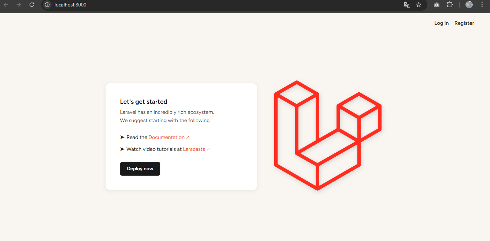

# LaravelLaboratorio2

## Objetivo
Implementar un sistema de Login y Registro en Laravel utilizando el patrón de arquitectura Modelo-Vista-Controlador (MVC), empleando el paquete `laravel/ui` con Bootstrap para la autenticación.

---

## Requisitos Previos

| Tecnología | Versión |
|---|---|
| PHP | 8.0 o superior |
| Composer | Última versión estable |
| Laravel | 12.x |
| WampServer | 64-bit |
| MySQL | Incluido en WAMP |
| Visual Studio Code | Recomendado |
| Node.js / NPM | Requerido para compilar assets |
| Sistema Operativo | Windows |

---

## Arquitectura MVC en Laravel

| Carpeta | Función |
|---|---|
| `app/Http/Controllers` | Contiene los controladores que manejan la lógica de la aplicación |
| `resources/views` | Contiene las vistas Blade (interfaz de usuario) |
| `app/Models` | Contiene los modelos que interactúan con la base de datos |
| `routes/web.php` | Define las rutas de la aplicación |

---

## Instalación y Configuración

### 1. Crear el proyecto
```bash
laravel new LaravelLaboratorio2
```

### 2. Entrar al proyecto
```bash
cd LaravelLaboratorio2
```

### 3. Instalar dependencias
```bash
composer install
npm install
```

### 4. Configurar archivo .env
```env
DB_CONNECTION=mysql
DB_HOST=127.0.0.1
DB_PORT=3306
DB_DATABASE=nombre_db
DB_USERNAME=root
DB_PASSWORD=
```

### 5. Generar clave de aplicación
```bash
php artisan key:generate
```

---

## 6. Autenticación (Laravel/UI con Bootstrap)

```bash
composer require laravel/ui
php artisan ui bootstrap --auth
npm install && npm run dev
```

Esto genera automáticamente las vistas de:
- Login
- Registro
- Recuperación de contraseña

---

## Base de Datos

Crear base de datos en **phpMyAdmin**, luego ejecutar migraciones:

```bash
php artisan migrate
```

Tablas generadas:
- `users`
- `password_reset_tokens`
- `sessions`
- `cache`
- `jobs`

> Se incluye respaldo de la base de datos en el repositorio.

---

##  Ejecución del proyecto

**Backend:**
```bash
php artisan serve
```

**Frontend:**
```bash
npm run dev
```

**Acceso:** `http://127.0.0.1:8000`

---

## Resultado



---

##  Dificultades y Soluciones

 **Problema 1: Error 500 – Server Error**
> El archivo `.env` estaba mal configurado o faltaba la APP_KEY

 **Solución:**
```bash
php artisan key:generate
php artisan config:clear
php artisan serve
```

---

 **Problema 2: Error con longitud de cadena en migraciones**
> Al correr `php artisan migrate` salía error de longitud de cadena

 **Solución:** Agregar en `AppServiceProvider.php`:
```php
use Illuminate\Support\Facades\Schema;

public function boot(): void
{
    Schema::defaultStringLength(191);
}
```

---

 **Problema 3: Laravel no tomaba los nuevos valores del .env**
> Después de editar el `.env`, Laravel seguía usando la configuración anterior

 **Solución:**
```bash
php artisan config:clear
php artisan config:cache
```

---

 **Problema 4: "Script dev not defined in composer.json"**
> Al correr `composer run dev` salía error porque el script no estaba definido

 **Solución:** Usar directamente:
```bash
npm run dev
```

---

## Referencias

- [Laravel Documentation](https://laravel.com/docs)
- [Laravel/UI Package](https://github.com/laravel/ui)
- [Composer](https://getcomposer.org)
- [Bootstrap](https://getbootstrap.com)
- [PHP Official Docs](https://www.php.net)

---

##  Fecha de Ejecución
9 de Abril de 2026

---

| | |
|---|---|
| **Nombre** | Antonio Castillo |
| **Correo** | antonio.castillo2@utp.ac.pa |
| **Curso** | DS7 |
| **Instructor** | Ing. Irina Fong |
